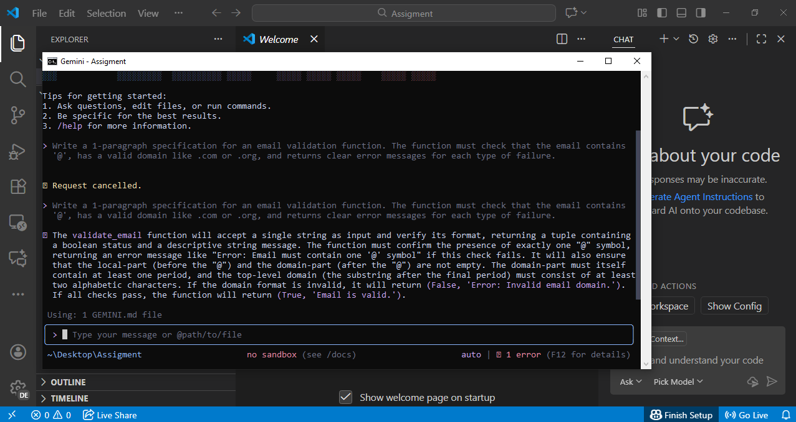

# 30-Day Challenge Task 2 💡

# Part A - (Short Questions)

## 1. Nine Pillars Understanding

### Why are AI Development Agents useful for repetitive setup tasks?
AI agents handle boring tasks like folder setup, configs, and basic boilerplate.  
This saves time and lets you focus on planning the system.  
Because you think more about structure , design and the real use case rather than just coding , it helps you grow as a system architect.

### How do the Nine Pillars help someone become an M-Shaped Developer?
The Nine Pillars make you work across many areas planning, specs, testing, coding, AI tools, and automation.  
Practicing all these skills together helps you become strong in multiple fields which is what makes an M-Shaped Developer.

## 2. Vibe Coding vs Specification-Driven Development

### Why does Vibe Coding cause problems after a week?
Vibe coding usally has no clear vision or plan.  
The code becomes messy, confusing, and difficult to update.  
We mostly forget why certain decisions were made, and new features often break old ones.

### How does Specification-Driven Development prevent those problems?
SDD makes you write clear specs and plan before coding.  
You define the flow, rules, and requirements first.  
Because of this, the final code is cleaner, easier to understand, and easier to maintain.

---

## 3. Architecture Thinking

###  How does architecture-first thinking change the developer’s role?
Instead of only writing code, you start thinking about how the whole system should work.  
You plan the structure, features, and data flow.  
This makes you act more like a system designer not just a coder.

### Why should developers think in layers instead of raw code?
Layered thinking keeps the system organized. Each layer has a clear job, making it easier to fix bugs, add features, and understand the app.  
Thinking only in raw code leads to confusion and messy projects.

# Part B - (Practical Task)

**prompt given** : "Write a 1-paragraph specification for an email validation function. The function must check that the email contains '@', has a valid domain like .com or .org, and returns clear error messages for each type of failure.

**Specification generated by Gemini Cli** : The validate_email function will accept a single string as input and verify its format,
returning a tuple containing a boolean status and a descriptive string message. The function
must confirm the presence of exactly one '@' symbol, returning an error message like
"Error: Email must contain one '@' symbol" if this check fails. It will also ensure that the
local-part (before the "@") and the domain-part (after the "@") are not empty. The domain-part
must itself contain at least one period, and the top-level domain (the substring after the final
period) must consist of at least two alphabetic characters. If the domain format is invalid, it
will return (False, 'Error: Invalid email domain.'). If all checks pass, the function will return
(True, 'Email is valid.').

# Part C - (Multiple Choices (Answers) )

1. B

2. B

3. B

4. B

5. C